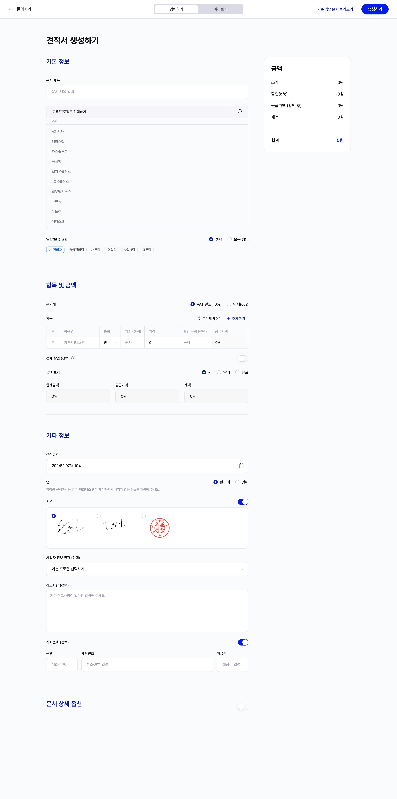

---
layout:
  title:
    visible: true
  description:
    visible: false
  tableOfContents:
    visible: true
  outline:
    visible: true
  pagination:
    visible: true
---

# 영업문서 생성 및 조회하기

## 영업문서 생성하기

<figure><figcaption></figcaption></figure>

홈페이지의 좌측 메뉴에서 '영업문서' 탭을 클릭하면,  프릭스에서 지원하는 영업문서 (견적서, 인보이스) 목록을 확인할 수 있습니다.&#x20;

* 다양한 영업문서 전체를 목록으로 조회할 수도 있고, 영업문서 종류별로 목록을 구분해서 조회할 수도 있습니다.&#x20;

견적서 / 인보이스 섹션 내 우측 상단의 '영업문서 생성하기' 버튼을 클릭하면 영업문서 생성 페이지로 이동할 수 있습니다.&#x20;

* 혹은 '고객 관리' 또는 '프로젝트 관리' 가이드 페이지에서 설명되어 있는 것처럼, 고객이나 프로젝트 상세 페이지에서 영업문서를 연결해 생성할 수도 있습니다.
  * 영업문서 생성 시, 고객 정보가 필요합니다. 기존 고객을 연결하거나 직접 고객 정보를 입력해 영업문서를 생성할 수 있습니다.&#x20;
* 영업문서 생성 페이지 우측 상단에는 '기존 영업문서 불러오기' 버튼을 통해, 기존에 생성했던 영업문서를 불러와 기본값으로 사용해 새로운 영업문서를 빠르게 만들 수 있습니다.&#x20;
* 영업문서 생성 시, 제목과 최소 1가지 이상의 항목을 필수로 입력해야 합니다.
  * 부가세 및 할인 정보를 설정할 수 있습니다.
    * 할인 정보는 영업문서 전체 혹은 개별 품목 별로 적용할 수 있습니다.
    * 항목 섹션 우측에 위치한 ‘부가세 계산기’를 통해 부가세를 계산할 수 있습니다.
  * 개별 품목 혹은 영업문서 전체에서 원화를 제외하고 달러 혹은 유로를 통화 단위로 사용할 수 있습니다.
  * 각 항목 별 절사 여부 체크 및 합계금액을 확인할 수 있습니다.
* 비즈니스 정보에서 설정한 회사 서명이 기본으로 선택됩니다.
* 계좌번호 및 참고사항을 입력할 수 있습니다.
* **\[Pro 요금제]** 2개 이상의 사업자 정보를 등록했다면, 영업문서를 생성할 사업자를 선택할 수 있습니다.

<figure><figcaption></figcaption></figure>

영업문서 생성 시에는, 상단에 위치한 '미리보기' 버튼을 통해 생성될 문서를 미리 확인할 수 있습니다.&#x20;

내용을 모두 입력했다면, 우측 상단에 위치한 '생성하기' 버튼을 클릭해 영업문서를 생성할 수 있습니다.&#x20;

## 인보이스 한 번에 생성하기

<figure><figcaption></figcaption></figure>

프로젝트와 연결해 인보이스를 대량으로 생성할 수 있습니다. (대량 생성은 영업문서의 인보이스만 가능합니다.)

프로젝트 목록 페이지 우측 상단에 위치한 '**옵션**'에서 '**엑셀로 프로젝트/일정 등록하기**' 버튼에서 양식에 맞게 엑셀로 업로드할 수 있습니다.&#x20;

* 샘플 데이터를 다운로드한 후, 양식에 맞게 값을 채워넣은 뒤 엑셀을 업로드하면 인보이스를 한 번에 등록할 수 있습니다.&#x20;
* 자세한 방식은 **\[프로젝트 관리 > 프로젝트 생성 및 조회하기 가이드]**를 참고해 주세요.

## 인보이스 대량 발송 (Pro 요금제 기능)&#x20;

<figure><figcaption></figcaption></figure>

Pro 요금제에 가입한 경우 인보이스 대량 발송 기능을 사용할 수 있습니다.&#x20;

인보이스 목록 좌측 체크박스에 체크를 하면 여러 개의 인보이스를 한 번에 발송할 수 있습니다.&#x20;

* 단, 대량 발송 시 수신인이 등록된 인보이스에 한해서 대량 발송이 가능합니다.&#x20;

## 견적서 정보로 인보이스 생성하기&#x20;

<figure><figcaption></figcaption></figure>

견적서 상세페이지 우측 상단의 옵션 팝오버에서 인보이스를 생성할 수 있습니다.&#x20;

## 영업문서 조회하기&#x20;

<figure><figcaption></figcaption></figure>

좌측 메뉴의 ‘영업 문서’ 메뉴의 하위 메뉴를 클릭하면 전체/유형별 목록을 확인할 수 있는 페이지로 이동됩니다.

목록 우측의 필터를 통해 문서 제목과 고객, 상태에 따라 문서 목록을 확인할 수 있습니다.

<figure><figcaption></figcaption></figure>

영업문서 목록에서 체크박스를 클릭해서 ‘복사하기’ 버튼을 통해 기존 영업문서를 복사할 수 있습니다.

* ‘복사하기’ 버튼을 클릭하면 설정, 상세설정, 서명, 연결된 고객/프로젝트까지 동일한 값을 가진 영업문서 복사본이 생성됩니다. <mark style="background-color:yellow;">(단, 연결된 일정은 복제되지 않습니다.)</mark>

## 문서 레이아웃 선택하기&#x20;

인보이스/견적서 생성 시, 레이아웃을 선택할 수 있습니다.

<figure><figcaption></figcaption></figure>

생성 이후에도 문서의 레이아웃을 변경할 수 있습니다. (상세페이지)&#x20;

<figure><figcaption></figcaption></figure>

