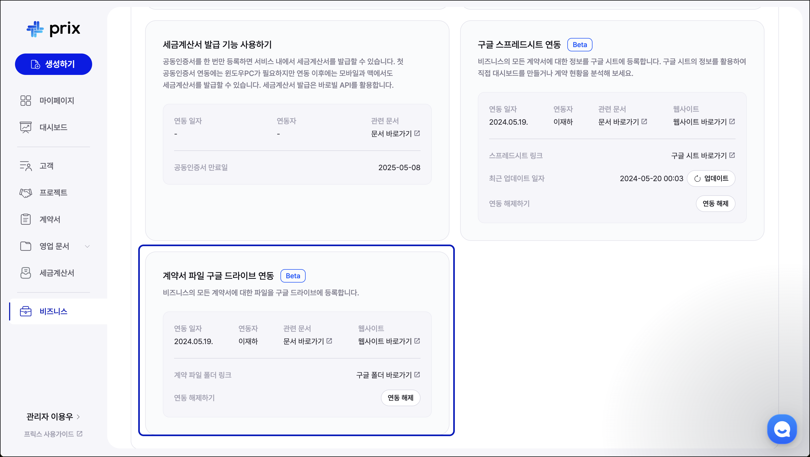

# 서비스 연동: 구글 드라이브

## 구글 드라이브 연동하기 (Pro 요금제 기능)

<figure><figcaption></figcaption></figure>

홈페이지의 좌측 메뉴에서 '비즈니스' 탭을 클릭하여 '비즈니스 관리' 페이지로 이동한 뒤, '서비스 연동' 섹션에서 구글 드라이브를 연동할 수 있습니다.

* 연동 및 연동 해제는 '관리자'만 가능합니다.
* 연동이 완료되면 구글 드라이브에 관련 폴더가 생성됩니다.&#x20;
* 연동된 상태에서 프릭스에서의 계약이 체결되면 구글 드라이브에 계약서가 자동으로 등록됩니다. (연동을 해제하면 전자계약이 체결되어도 구글 드라이브에 등록되지 않습니다.)
